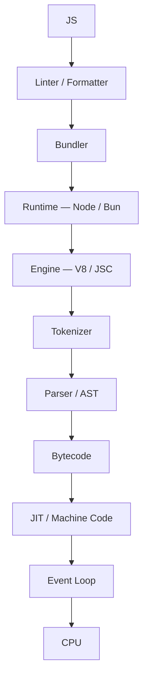

> JavaScript executes your code through a chain of layers. You type one line. Multiple layers later, a CPU executes an instruction. This post describes what happens in between.

Most developers do not know how their code runs. They know that it runs, and they treat this as sufficient. They run `npm run dev`, a port opens, and they return to other work. This post explains the layers that execute their code every time.

Here is the code that the post follows through each layer:

```js
async function getUser() {
    const res = await fetch("https://api.example.com/user/1");
    const data = await res.json();
    console.log(data.name);
}

getUser();
```

Now the post shows what each layer does to it.

## The Editor and the Linter

Before the engine reads the code, a linter reads it. You can use [ESLint](https://eslint.org/), [Biome](https://biomejs.dev/), or [OXC (Oxlint)](https://oxc.rs/). The linter checks the code before the engine executes it. It does not execute the code. It checks the source for problems. For example, it identifies a `console.log` statement that remains in code intended for production.

The linter uses the same [AST](https://en.wikipedia.org/wiki/Abstract_syntax_tree) that the engine will later produce. It reads the AST first, before the engine compiles the code. Its output is not code. Its output is annotations and warnings.

The **formatter** follows the linter. You can use [Prettier](https://prettier.io/), Biome, or the OXC formatter (Oxfmt). The formatter does not care what your code means. It checks that the indentation is consistent. It checks that no line is 300 characters long. The structure of the code is sound. The formatter makes the code presentable.

Neither of these tools executes your code. They work in the pre-execution layer, before the code runs.

## The Bundler

You have written `getUser` in one file. In another file, you have written the UI that calls it. In other files, you have written a utility function, a type definition, and a third-party library from npm. In development, these files are separate. A browser needs a single address for the code.

The **bundler** flattens all these files into a small set of deliverable artifacts. You can use [Vite](https://vite.dev/), [Rolldown](https://rolldown.rs/), [Turbopack](https://turborepo.dev/), [esbuild](https://esbuild.github.io/), or [webpack](https://webpack.js.org/). The bundler traces the import graph. `getUser` imports `fetch`, which imports this, which imports that. The bundler follows every import to its origin.

```text
src/
  index.ts      ← imports getUser
  api/
    user.ts     ← defines getUser, imports fetch-wrapper
  utils/
    http.ts     ← defines fetch-wrapper
node_modules/
  some-lib/     ← also imported, transitively

         ↓  bundler traces every import  ↓

dist/
  bundle.js     ← one file, everything resolved
```

Modern bundlers do additional work in this phase: **tree-shaking** (removing code that is imported but never called), **code splitting** (producing multiple bundles that load on demand), and **transpilation** (converting your TypeScript or modern JavaScript into a form that a wider range of environments can run).

Vite does this work in a specific way. In development, Vite skips bundling almost entirely. It serves individual files over native ES modules. It uses the browser's own module resolution. It bundles only for production. **Rolldown** is Vite's Rust-powered bundler, built on OXC. Older versions of Vite use **Rollup**. Rolldown completes this work quickly. **Turbopack** is the Rust-powered successor to webpack, embedded in Next.js. It takes a similar approach. All these tools converge on the same idea: do the minimum possible work, as fast as possible, and then stop.

The output of the bundler is a JavaScript file. It is one file, or a small set of files, ready to be handed to a runtime.

## The Runtime: Node, Bun, or the Browser

Your bundled `bundle.js` now needs a runtime. If this is a server, that runtime is **Node.js** or **Bun**. If it is a browser, that runtime is Chrome, Firefox, or Safari. The distinction matters.

Node.js is a thin shell around **V8**, Google's JavaScript engine, combined with **libuv**. libuv is a C library. It provides the event loop, the thread pool, and the operating system bindings that JavaScript itself cannot provide. When you call `fetch` in Node 18+, it is not V8 that makes the network request. V8 does not know what a network is. Node's built-in undici HTTP client makes the request. undici is written in JavaScript and C++. It is wrapped in a Web-compatible `fetch` API. It is registered as a global. Your code can call it without knowing any of this.

**Bun** is a newer runtime. Node wraps V8. Bun wraps **JavaScriptCore**, Apple's JavaScript engine. JavaScriptCore runs Safari and every JavaScript runtime on iOS. Bun is written in Zig. It runs JavaScriptCore. It reimplements Node's APIs from scratch, with an emphasis on speed. The same `fetch` call and the same `async/await` syntax work. Underneath, there is a different engine, a different event loop implementation, and different tradeoffs.

The runtime provides the environment for the code. The engine executes the code. You cannot have one without the other.

## The Engine: V8, JavaScriptCore

Now the post arrives at the engine. V8 powers Node, Chrome, and Deno. JavaScriptCore powers Bun and Safari. The engines differ in implementation but have the same contract: they take JavaScript source and they execute it.

### The Tokenizer

The engine reads the source file character by character. It chops the source into **tokens**. A token is the smallest unit of meaning that the language recognizes.

```text
KEYWORD(async)  KEYWORD(function)  IDENT(getUser)  PUNCT(()  PUNCT())
PUNCT({)  KEYWORD(const)  IDENT(res)  PUNCT(=)  KEYWORD(await)
IDENT(fetch)  PUNCT(()  STRING("https://api.example.com/user/1")  PUNCT())
...
```

The tokenizer does not know that `fetch` is a function. It does not know that `await` implies a suspension point. It only knows that these sequences of characters mean something to the grammar above it. Its job ends there, and it hands off.

### The Parser and the AST

A list of tokens is not a program. The **parser** folds the tokens into an **Abstract Syntax Tree** (AST). The AST is a nested structure. It captures what the tokens are. It also captures how they relate.

```json
{
  "type": "FunctionDeclaration",
  "async": true,
  "id": { "name": "getUser" },
  "body": [
    {
      "type": "VariableDeclaration",
      "kind": "const",
      "declarations": [
        {
          "id": { "name": "res" },
          "init": {
            "type": "AwaitExpression",
            "argument": {
              "type": "CallExpression",
              "callee": { "name": "fetch" },
              "arguments": [{ "value": "https://api.example.com/user/1" }]
            }
          }
        }
      ]
    }
  ]
}
```

The AST shows that `fetch(...)` lives inside an `AwaitExpression`. The `AwaitExpression` lives inside a `VariableDeclaration`. The `VariableDeclaration` lives inside an `async FunctionDeclaration`. The relationship between the parts matters.

### The Bytecode

The AST cannot be handed directly to a CPU. It must be translated into **bytecode**. Bytecode is a compact, portable instruction set. V8's **Ignition** interpreter executes it. JSC's **LLInt** is the equivalent interpreter.

```text
CreateClosure [getUser]
CallUndefinedReceiver [getUser]
SuspendGenerator        // first `await` pause here
CallRuntime [fetch, "https://api.example.com/user/1"]
ResumeGenerator         // fetch resolved continue
StoreAccumulatorInRegister [res]
...
```

The interpreter does not explain the purpose of each instruction. It executes each instruction one at a time. Bytecode is still somewhat legible. It is not machine code yet.

### The JIT Compilation

If `getUser` were called once, Ignition would interpret the bytecode line by line. This is adequate, but not fast. Both V8 and JSC watch the code. They instrument the code. They identify hot paths, which are functions called repeatedly. They promote hot paths to an optimizing compiler.

V8 uses **TurboFan**. It increasingly uses **Maglev** as a mid-tier compiler. JSC uses **DFG** and **FTL**. All of them output raw **machine code**. Machine code is binary instructions. The CPU executes machine code directly, with no interpretation overhead.

```asm
mov rdi, [fetch_ptr]
mov rsi, url_string_addr
call [rdi]
test rax, rax
jz   handle_rejection
...
```

The CPU has no concept of `async`. It has no concept of `fetch`. It has no concept of JavaScript. It knows registers, memory addresses, and conditional jumps. Every layer above this one is an abstraction from the CPU's perspective.

## The Event Loop

JavaScript is single-threaded. It has one worker and one call stack. It handles a network request without freezing. This is not magic. It is the event loop. It is worth understanding it precisely.

When execution hits `await fetch(...)`:

```text
// Moment of the await:
Call Stack: [ getUser, (anonymous) ]

// getUser() hits `await`. It is SUSPENDED and removed from the stack.
// The Promise is handed to Node's networking layer a subcontractor
// operating entirely outside the JS thread, in libuv's thread pool.

Call Stack: [ (anonymous) ]  ← nearly empty. The worker is FREE.

// ...time passes. The network responds. The Promise resolves.
// The resolved value enters the Microtask Queue.
// The Event Loop checks: call stack empty? Yes.
// getUser() is reinstated, res bound to the Response object.

Call Stack: [ getUser, (anonymous) ]  ← resumed, mid-function.
```

The **Event Loop** manages the queues. The call stack never idles waiting for the network request. The network request is offloaded entirely. When the request delivers a result, the event loop queues the result. It hands the result to the worker the moment the worker is free.

`await` is not sleep. `await` suspends a function and hands control back. The function resumes when the data arrives. No work stops. Other work proceeds. This is why Node can serve thousands of concurrent requests on a single thread: not because it parallelizes, but because it never waits.

## The Complete Process



Each layer does exactly one job. It does not know the layers above it. The linter does not bundle. The bundler does not optimize. The JIT does not manage async. The CPU does not parse.

You typed `getUser()`. Eleven layers executed it. Most of the layers ran without your knowledge.