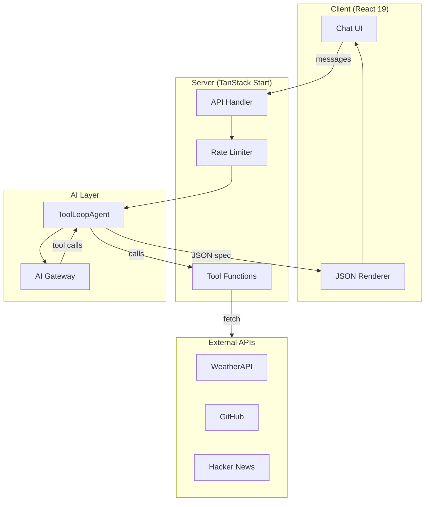

## Overview

Kite is an AI-powered data exploration assistant. You ask questions about weather, crypto prices, GitHub repositories, or news. Kite fetches real-time data and builds interactive dashboards. The dashboards render entirely from JSON UI specifications. Kite serves as a reference implementation of the AG-UI protocol.

## Approach

Kite separates concerns across four layers:

- **Client:** React 19 UI with streaming chat. It renders AI responses as JSON-defined UI components with `@json-render/react`.
- **Server:** TanStack Start server functions handle requests and rate limiting. They proxy requests to the AI layer.
- **AI:** ToolLoopAgent orchestrates tool calls. It formats responses as text and JSON UI specs.
- **Tools:** Server-side functions fetch real data from external APIs (weather, GitHub, crypto, web search).

## How It Works

1. **You send a message** asking about any topic (weather, crypto, GitHub, etc.)
2. **The agent calls tools** to fetch real, up-to-date data from external APIs
3. **The agent responds** with a conversational summary and a JSON UI specification
4. **The UI renderer** transforms the JSON spec into interactive React components
5. **You see a dashboard** with charts, tables, metrics, and rich content

The UI is defined entirely in JSON. The AI outputs both text and a component tree. `@json-render/react` renders the component tree.

## Tech Stack

<TechStack variant="embedded">
  <TechStackItem label="TanStack Start"><Tanstack className="tech-stack-icon-needs-invert" /></TechStackItem>
  <TechStackItem label="React 19"><ReactLight /></TechStackItem>
  <TechStackItem label="shadcn/ui"><ShadcnUi className="tech-stack-icon-needs-invert" /></TechStackItem>
  <TechStackItem label="Tailwind CSS 4"><Tailwindcss /></TechStackItem>
  <TechStackItem label="Upstash Redis"><Upstash /></TechStackItem>
  <TechStackItem label="Netlify"><Netlify /></TechStackItem>
  <TechStackItem label="AI SDK"><Vercel className="tech-stack-icon-theme-light" /><VercelDark className="tech-stack-icon-theme-dark" /></TechStackItem>
</TechStack>
